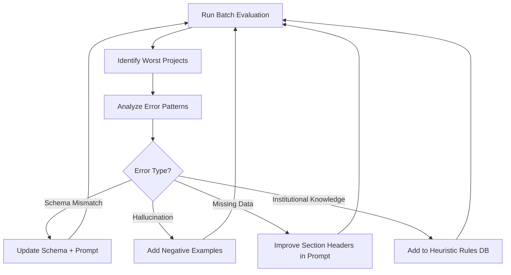

# AutoInfra Extraction Pipeline Optimization Plan

## Executive Summary

The current pipeline is producing **0-6% accuracy** against ground truth. After deep-diving into the Georgian Dr project and cross-referencing with the template structure and 3 other ground truth spreadsheets, the root causes are now clear. **This is not a model problem — it's a prompt engineering and schema mapping problem.**

> [!CAUTION]
> The model is extracting what we *asked* for, but what we asked for **does not match how the estimator actually fills in the spreadsheet**. The template is much more nuanced than a simple row-per-entity extraction.

---

## Root Cause Analysis

### 🔴 Critical Issue 1: MANHOLES Schema is Completely Wrong

**What the prompt asks for:**
```
Per-manhole row: MH 1 → top_elevation, low_invert, high_invert, pipe_out_diameter, structure_type
```

**What the ground truth actually shows (Georgian Dr):**
```
Row 11: "DCBMH 2"       (just a description, no numeric data)
Row 12: "MH 1/O.P."     (just a description, no numeric data)
Row 13: "GREENSTORM"     (section header)
Row 14: "CATCHBASINS"    (section header)
Row 15: "ITEMS"  "QNTY"  "WALL"  "DPTHm"  "$GT ea"  "$/ADDMAT"   ← custom sub-header!
Row 16: "SINGLE C.B.'S"  2  4  2.2  0  900
Row 17: "DOUBLE C.B.'S"  -  4  2.2  0  0
Row 18: "DITCH INLT CB'S"  1  4  2.2  0  900
```

**Finding:** The estimator uses a **summarized/grouped format** — counting catch basins by type (single, double, ditch inlet) with wall thickness, depth, and cost data. The prompt's per-manhole-with-elevations schema doesn't match reality at all.

### 🔴 Critical Issue 2: SEWERS Data is Partially Correct but Labels are Wrong

| Field | Ground Truth | Model Output | Issue |
|-------|-------------|-------------|-------|
| Run Label | `CB 3-DCBMH 2` | `CB-1-CB-5` | Model invents names instead of reading actual labels |
| Pipe Diameter | 300 | 200 | Model defaults to 200 when unsure |
| Type/Class | 2.35 | 1.3 | Model uses wrong default |
| Slope | 1.1 | 32.5 | Model confuses slope units (‰ vs %) |

**Also:** The ground truth includes non-pipe line items like `SWALE`, `VIDEO ($25/m)`, `LAYOUT`, `AS BUILT` — these are estimating line items, not pipe runs. The model doesn't know about these.

### 🔴 Critical Issue 3: Additional Material Costs ($ADDMAT) Column

The column H in ground truth has specific material surcharges (e.g., `900` for catch basins with grates, `1730` for special connections). These are institutional knowledge costs that the model can't extract from drawings — they come from the estimator's experience.

### 🟡 Issue 4: WATERMAIN Extraction

Georgian Dr had no watermain work, but the model hallucinated 2 watermain runs. The model should output empty arrays when no watermain infrastructure is shown.

---

## Optimization Strategy

### Phase 1: Ground Truth Analysis (2-3 hours)
> Build a systematic understanding of how *every* project's spreadsheet is actually structured.

**Steps:**
1. Run the compare script across **all 40+ projects** that have both PDF + XLSX
2. Extract the actual data patterns from ground truth (grouped vs per-item, which columns are human-entered vs formula-calculated)
3. Catalog the "line item types" that appear across projects:
   - Standard pipe runs (sewer/watermain)
   - Grouped structure counts (single CB, double CB, etc.)
   - Non-pipe items (swale, video inspection, layout, as-built, dewatering, etc.)
   - Cost override items (additional materials, labor)

**Deliverable:** A `ground-truth-patterns.json` catalog of every unique entry pattern seen across all 66 projects.

### Phase 2: Schema Redesign (1-2 hours)
> Redesign the extraction schema to match how the estimator actually works.

**Key Changes:**

#### Manholes → Structure Summary Table
```typescript
interface StructureSummary {
  // Section 1: Named structures (MH/CBMH labels for reference only)
  namedStructures: { label: string; notes: string }[];
  
  // Section 2: Grouped CB/MH counts with pricing
  structureGroups: {
    type: 'SINGLE_CB' | 'DOUBLE_CB' | 'DITCH_INLET_CB' | 'DOUBLE_DITCH_INLET_CB' | 'MH_STD' | 'MH_LRG';
    quantity: number;
    wallThickness: number; // inches
    depth: number; // meters
    grateEach: number; // $ per unit
    addMaterials: number; // $ additional materials
  }[];
  
  // Section 3: Labor costs
  laborRates: {
    scbLabor: number;  // $/unit for single CB
    dcbLabor: number;  // $/unit for double CB
    // frame & cover costs
    dicbFC: number;
    ddicbFC: number;
  };
}
```

#### Sewers → Include Non-Pipe Line Items
```typescript
interface SewerEntry {
  runLabel: string;
  length: number | null;      // null for non-pipe items
  pipeDiameter: number | null;
  typeClass: number | null;
  slope: number | null;
  depth: number | null;
  addMaterials: number;
  addLE: number;
  isLineItem: boolean;  // true for SWALE, VIDEO, LAYOUT, etc.
  lineItemType?: string;
}
```

### Phase 3: Prompt Engineering with Few-Shot Examples (2-3 hours)
> The single biggest accuracy lever — show the model what correct output looks like.

**Strategy:**
1. Select 3-5 representative ground truth projects spanning different complexity levels
2. Pair each project's drawing PDF with its completed spreadsheet
3. Build a **few-shot prompt** that includes:
   - The drawing pages as images
   - The correctly filled spreadsheet data as the expected JSON output
   - Explicit rules about what goes in each column

```
Example prompt structure:
───────────────────────────
SYSTEM: You are a civil engineering cost estimation expert...

EXAMPLE 1:
[Drawing PDF pages for Project A]
CORRECT OUTPUT:
{structured JSON matching new schema}

EXAMPLE 2:
[Drawing PDF pages for Project B]  
CORRECT OUTPUT:
{structured JSON matching new schema}

NOW PROCESS THIS NEW DRAWING:
[User's drawing pages]
───────────────────────────
```

> [!IMPORTANT]
> Few-shot examples are the most impactful improvement for Gemini. Each example teaches the model what data to extract and how to format it. 3 good examples will dramatically outperform any amount of prompt text alone.

### Phase 4: Batch Evaluation Pipeline (1-2 hours)
> Automate running the model on all projects and measuring accuracy.

Build `src/scripts/batch-evaluate.ts`:
1. For each project with both PDF + XLSX ground truth:
   a. Run extraction on the PDF
   b. Populate the template with extraction results
   c. Save to `generated_spreadsheets/` subfolder
   d. Run cell-by-cell comparison against ground truth
2. Output a CSV scoreboard:

```
Project                              | MH Acc | SW Acc | WM Acc | Overall | Notes
2026-001 ECOLE SECONDAIRE           |   82%  |   91%  |   75%  |   83%   | 
2026-002 BRADFORD CIVIC CENTRE      |   78%  |   88%  |   N/A  |   83%   |
...
```

### Phase 5: Iterative Refinement Loop (Ongoing)



**Convergence targets per iteration:**
| Iteration | Target Accuracy | Focus |
|-----------|----------------|-------|
| 1 | 40-50% | Schema fix + basic few-shot |
| 2 | 60-70% | Add 3 more few-shot examples |
| 3 | 75-85% | Heuristic post-processing rules |
| 4 | 85-90% | Edge case handling |
| 5+ | 90%+ | Per-project prompt tuning |

### Phase 6: Persistent Heuristics Database (1 hour)
> Encode learned patterns that the model can't extract from drawings alone.

Store in Firestore (or local JSON):
```json
{
  "defaultTypeClass": {
    "storm_concrete": 2.35,
    "storm_pvc": 1.3,
    "sanitary": 1.3
  },
  "slopeDefaults": {
    "200mm": 1.1,
    "250mm": 1.1,
    "300mm": 1.1
  },
  "additionalLineItems": [
    {"label": "SWALE", "category": "earthwork"},
    {"label": "VIDEO ($25/m)", "category": "inspection"},
    {"label": "LAYOUT", "category": "survey"},
    {"label": "AS BUILT", "category": "survey"},
    {"label": "DEWATERING", "category": "earthwork"}
  ],
  "catchBasinCosts": {
    "singleCB_frameCover": 465,
    "doubleCB_frameCover": 715,
    "ditchInletCB_frameCover": 465
  }
}
```

---

## Implementation Priority

| Priority | Task | Impact | Effort | Status |
|----------|------|--------|--------|--------|
| **P0** | Redesign MANHOLES schema to match grouped format | 🔴 Critical | 2h | ⬜ |
| **P0** | Add few-shot examples from 3 ground truth projects | 🔴 Critical | 3h | ⬜ |
| **P1** | Fix sewer slope units (‰ vs %) | 🟡 High | 30m | ⬜ |
| **P1** | Add non-pipe line items to sewer schema | 🟡 High | 1h | ⬜ |
| **P1** | Build batch evaluation pipeline | 🟡 High | 2h | ⬜ |
| **P2** | Add hallucination guard (empty sections when no data) | 🟢 Medium | 1h | ⬜ |
| **P2** | Build heuristics database for default costs | 🟢 Medium | 1h | ⬜ |
| **P3** | Spreadsheet cell mapping fixes | 🟢 Medium | 1h | ⬜ |

---

## Key Insight

> [!TIP]
> **The model's "training" doesn't happen via weight updates — it happens via prompt engineering.** Each few-shot example is worth more than thousands of words of instructions. The fastest path to 85%+ accuracy is:
> 1. Fix the schema to match reality
> 2. Add 3-5 ground truth examples as few-shot pairs
> 3. Iterate based on batch evaluation metrics

The current 0% accuracy is entirely fixable without any model fine-tuning. It's a **prompt + schema problem**, not a capability problem.
